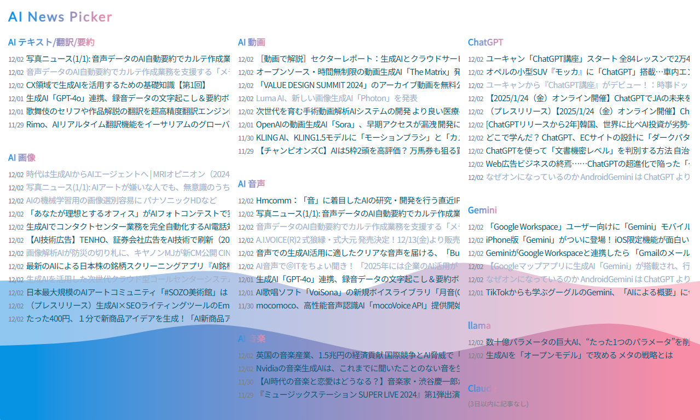

# RSS Reader
本プロジェクトは、複数のRSSフィードを効率的に収集・整理する<ins>一覧性のいい</ins>RSSリーダーアプリケーションです。さまざまなテーマの最新ニュースを簡単に取得し、日々の情報収集をより便利にします。
直感的なUIと軽量な設計で快適なユーザー体験を提供します。

This project is an RSS reader application designed to efficiently collect and organize multiple RSS feeds, offering <ins>an intuitive and highly visual layout</ins>. It allows users to easily access the latest news on various topics, making daily information gathering more convenient. With its intuitive UI and lightweight design, it delivers a comfortable user experience.



## 特徴
- マルチRSSサポート: 複数のRSSフィードを統合的に管理。複数のRSSフィードをまとめて一つのRSSフィードとして扱うことも可能。
- 多言語翻訳: 記事タイトルを自動翻訳。
- レスポンシブデザイン: PCからスマートフォンまで最適化されたUI。
- Multi-RSS Support: Manage multiple RSS feeds seamlessly. It is also possible to consolidate multiple RSS feeds into a single RSS feed.
- Multilingual Translation: Automatically translate article titles.
- Responsive Design: Optimized UI for devices ranging from PCs to smartphones.

## セットアップ
1. 必要な依存ライブラリをインストールしてください / Please install the required dependency libraries.
   ```bash
   pip install flask feedparser googletrans
   ```

2. templates/index.html内でRSSのURLを指定（Googleニュースがおすすめ） / Specify the RSS URL in templates/index.html (Google News is recommended).
   ```
   // 複数のRSSフィードをロード（複数のRSSフィードをまとめて一つのRSSフィードとして扱うことも可能。）
   loadRSS('feed1', ['URL1', 'URL', 'URL3']);
   loadRSS('feed2', ["URL4"]);
   loadRSS('feed3', ["URL5"]);
   // 必要に応じてさらにフィードを追加
   ```

4. 必要に応じてapp.py内で翻訳するURLを指定 / Specify the URL for translation within app.py as needed.

   以下はGoogleニュースのRSSフィードの例 / Here is an example of a Google News RSS feed:
   ```
   # 英語の翻訳
   if 'ceid=US:en' in url:
       translator = Translator()
       for entry in filtered_entries:
           entry['title'] = translator.translate(entry['title'], src='en', dest='ja').text
   # 中国語の翻訳
   if 'ceid=CN:zh-Hans' in url:
       translator = Translator()
       for entry in filtered_entries:
           entry['title'] = translator.translate(entry['title'], src='zh-cn', dest='ja').text
   # 韓国語の翻訳
   if 'ceid=KR%3Ako' in url:
       translator = Translator()
       for entry in filtered_entries:
           entry['title'] = translator.translate(entry['title'], src='ko', dest='ja').text
   ```

5. Flaskサーバーを起動 / Start the Flask server.
   ```bash
   python app.py
   ```

## 免責事項 / Disclaimer
本プログラム（以下「本ソフトウェア」）は、現状有姿（"AS IS"）で提供されます。本ソフトウェアの使用に関する以下の事項をご了承ください。<br>
The program (hereinafter referred to as "the Software") is provided "AS IS". Please note the following terms regarding the use of the Software:
- 保証の否認: 本ソフトウェアは、明示的または黙示的を問わず、いかなる保証もなく提供されます。特定の目的への適合性、商品性、非侵害性に関する保証を含みますが、それに限定されません。
- 責任の制限: 本ソフトウェアの使用、または使用不能に起因する、いかなる損害（直接的、間接的、偶発的、特殊的、結果的損害を含むがこれに限らない）についても、著作者または権利保有者は一切の責任を負いません。
- 自己責任の原則: 本ソフトウェアの使用は、すべてユーザー自身の責任において行われるものとします。本ソフトウェアの使用によって生じた問題について、著作者または権利保有者は一切の責任を負いません。
- Disclaimer of Warranties: 
The Software is provided without any warranties, express or implied. This includes, but is not limited to, warranties of fitness for a particular purpose, merchantability, and non-infringement.

- Limitation of Liability: 
The authors or copyright holders shall not be held liable for any damages (including, but not limited to, direct, indirect, incidental, special, or consequential damages) arising from the use of or inability to use the Software.

- Use at Your Own Risk: 
The use of the Software is entirely at the user's own risk. The authors or copyright holders assume no responsibility for any issues that may arise from the use of the Software.
